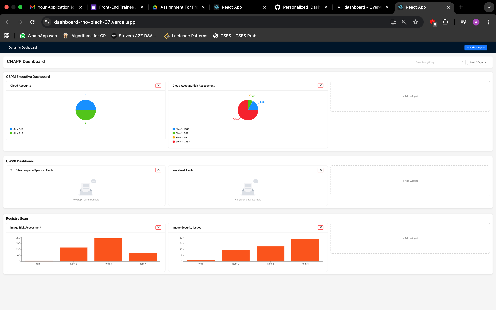
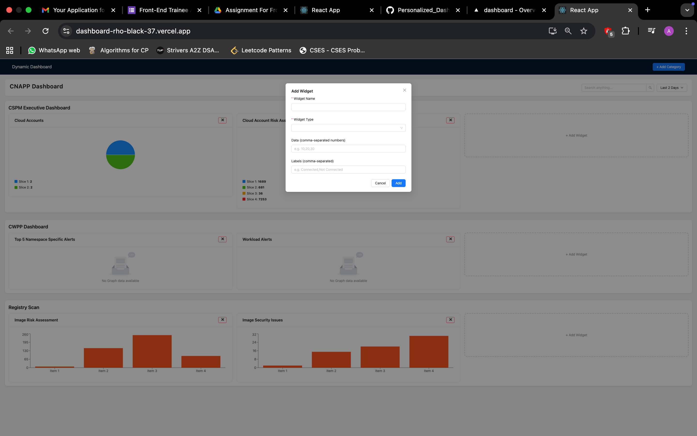
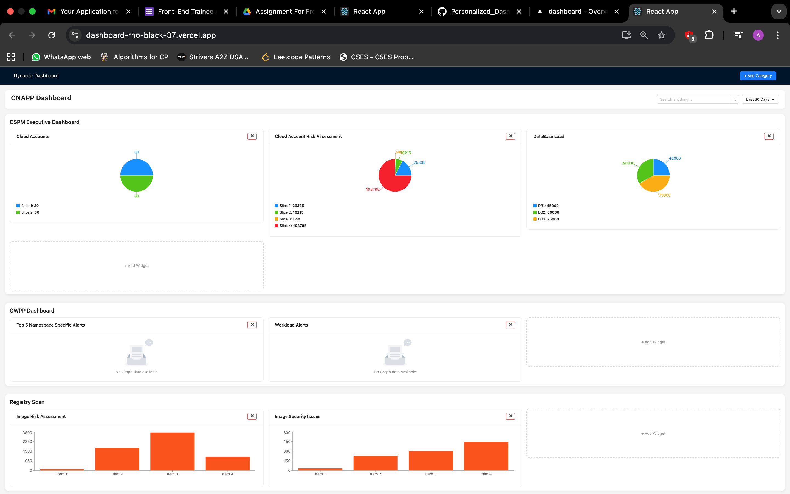

# Dynamic Dashboard (CNAPP Style)

This project is a **React + Redux Toolkit + Ant Design + Recharts** implementation of a dynamic dashboard UI.  
It allows users to **create categories, add/remove widgets, filter data, and view charts dynamically**.  

The UI and flow are inspired by CNAPP dashboards.

---

## 📸 Screenshots

### 1. Reference Design


### 2. Implemented Dashboard

[Implemented Dashboard](./Screenshot3.png)

### 3. Add Widget Modal


---

## 📂 Project Structure
---
```
src/
├── components/
│ ├── Dashboard.jsx # Main dashboard with search & time filter
│ ├── Category.jsx # Renders a category and its widgets
│ ├── Widget.jsx # Handles widget rendering (Donut/Bar/Empty)
│ ├── AddCategoryModal.jsx # Modal for adding new categories
│ └── AddWidgetModal.jsx # Modal for adding new widgets
├── store/
│ ├── dashboardSlice.js # Redux slice for categories, widgets, timeRange
│ └── store.js # Store configuration
├── App.jsx # Root component with Layout & Category modal
├── main.jsx # React entry point with Redux provider
└── index.css # Global and custom styles

---

## 🚀 Features

- **Categories**
  - Add and remove categories dynamically.
- **Widgets**
  - Add and remove widgets inside categories.
  - Supports:
    - **Donut Chart**
    - **Bar Chart**
    - **Empty Widget** (no data).
- **Dynamic Data**
  - Enter comma-separated numbers for data and labels when creating a widget.
  - Example:
    - Data: `10,20,30`
    - Labels: `Critical,High,Low`
- **Charts**
  - Donut chart with legends (labels + values).
  - Bar chart with axis and tooltips.
  - Empty widget with placeholder message.
- **Filters**
  - Search bar to filter widgets by title.
  - Time range selector:
    - Last 2 Days
    - Last 10 Days
    - Last 30 Days
  - Widget values scale dynamically with the selected time range.
- **UI**
  - Clean, modern design with **Ant Design**.
  - Each category appears in a rounded, shadowed section.
  - Widget placeholders (`+ Add Widget`) with dashed borders.
```
---

## ⚙️ How It Works

1. **State Management**  
   - Managed with **Redux Toolkit**.  
   - `dashboardSlice.js` handles:
     - Categories
     - Widgets
     - Time range state  

2. **Widgets**  
   - A widget has:
     - `title` → Widget name
     - `type` → `donut` | `bar` | `empty`
     - `data` → Array of numbers
     - `labels` → Array of strings  

3. **Chart Rendering**  
   - Donut & bar charts are built with **Recharts**.  
   - Legends for donut charts are dynamically generated.  
   - Bar charts automatically bind labels to X-axis.  

4. **Dynamic Behavior**
   - Changing the **time range** scales widget data.  
   - Search bar filters widget titles in real time.  
   - Add widget modal allows quick input of data & labels.  

---

## 🛠️ Tech Stack

- **React 18**
- **Redux Toolkit**
- **React Redux**
- **Ant Design**
- **Recharts**
- **UUID** (unique IDs for categories & widgets)

---

## 🖥️ Steps to Run Locally

### 1. Clone the Repository
```bash
git clone https://github.com/your-username/Dashboard.git
cd Dashboard
2. Install Dependencies
npm install

3. Start the App


For Create React App:

npm start


Visit: http://localhost:3000

📖 Example Workflow

Add a new category → Creates a new section.

Add a widget → Choose type (Donut/Bar/Empty), provide data + labels.

Switch time range → Widget values update dynamically.

Use search → Quickly filter widgets by name.

Remove → Delete any widget or category instantly.
